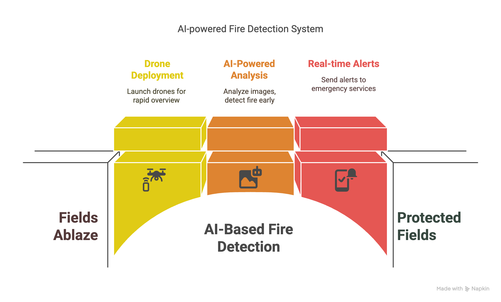

# SET University: Introduction to Deep Learning

Student: Maksym Zemlianyi <m.zemlianyi@setuniversity.edu.ua>

[UA] Presentation available by the [link](https://docs.google.com/presentation/d/15LqUJPdWDSpNShVgjHS_0L9fpICyEIy9/edit?usp=sharing&ouid=108251022595842283383&rtpof=true&sd=true) (available for viewing from the university's email domain @setuniversity.edu.ua)

## Capstone project: Binary classification for fire detection with MobileNetV2

### User Story and Problem Statement

👨‍🌾 Farmer Serhii
A farmer from Sumy region whose fields are regularly set on fire due to enemy shelling.

🔥 Threat to Crops
Fire destroys crops and infrastructure, causing significant economic losses.

🚑 Risks for Emergency Services (SES)
Rescuers are under threat from ballistic missile and MLRS (Multiple Launch Rocket System) attacks.

🤖 AI-based Solution
Our fire detection system can help respond in time and save lives.

**An early fire detection system based on deep learning can significantly reduce risks for rescuers and help farmers protect their crops.**



### Binary Image Classification as a Solution

🖼️ Task
Classify images into 2 categories: fire OR non-fire

🔤 Input Data
RGB images with resolution 224×224 pixels

💾 Output Data
Probability of fire presence (0–1)

🧠 Training Dataset
755 images with fire, 244 without fire: https://www.kaggle.com/datasets/phylake1337/fire-dataset


### Model Training Process

#### Model Architecture

* `MobileNetV2` – convolutional neural network

* `ImageNet` as the base model

* `Sigmoid` as the activation function

#### Training and Optimization

* Feature extraction for 10 epochs

* Fine-tuning with 50 unfrozen layers

* Stabilization and optimization using the Adam optimizer

* Binary cross-entropy loss function

* `Early Stopping` and `ReduceLROnPlateau` for dynamic learning rate adjustment

### Local development 

#### Requrements 

* make 3.8+
* python 3.11+
* pyenv 2.4.10

```
pip install -r requirements.txt
```

#### Configuration

Config for management most of the things for automation could be found `/config/training_cfg.yaml`

```

dataset:
  name: "phylake1337/fire-dataset" # kaggle_id, link: https://www.kaggle.com/datasets/phylake1337/fire-dataset
  ds_folder: "dataset"
  ds_local_path: "dataset/fire_dataset"

model:
  img_height: 224
  img_width: 224
  num_classes: 1 # 0: no fire, 1: fire

data_split:
  test_size: 0.15 
  validation_size: 0.15

training:
  batch_size: 32 # batch size
  initial_epochs: 10 # Num of epochs for learning feature extraction
  fine_tune_epochs: 20 # Num of epochs for fine-tuning
  initial_learning_rate: 0.001 # inital learn rate for feature extraction
  fine_tune_learning_rate: 0.0001 # learning rate for fine tuning
  early_stopping_patience: 10 # Num of epochs to execute before enable fine tuning
  reduce_lr_factor: 0.2 # Learning rate reduction factor
  reduce_lr_patience: 5 # Number of epochs without improvement before learning rate decreases
  min_lr: 0.000001 # Minimum learning rate for the initial stage
  min_lr_fine_tune: 0.0000001 # Minimum learning rate for fine-tuning
  unfreeze_layers_from_end: 50 # ufreezing last 50 layaers from the end

paths:
  model_save_path: "models"
  report_path: "reports/dataset_outcome_report.html"
```

It could be customzed with another values or new more parameters for fine-tuning `MobileNetV2` could be added, but in that case some modification of the code would be required

#### Quick start

```
make learn
```

OR to use GPU:

```
make learn GPU=true
```

all things happened e2e automatically from downloading the dataset and ends with report generation in HTML format as an artifact, which can be found `/report/dataset_outcome_report.html`

Currently under this folder example of report could be found

